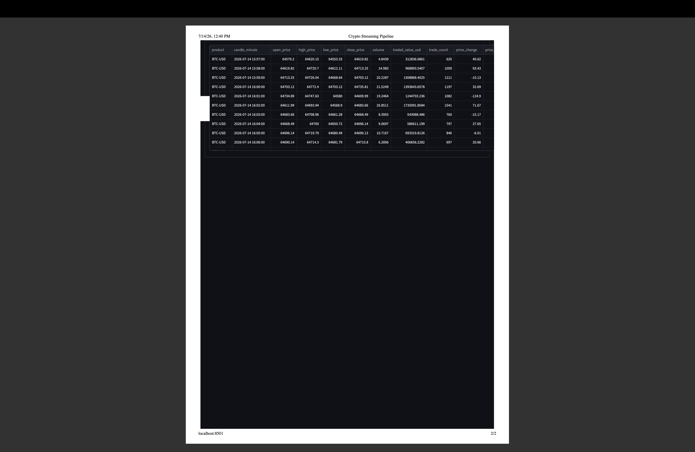

# Real-Time Crypto Streaming Pipeline

An end-to-end streaming data pipeline that ingests live cryptocurrency trades from Coinbase, processes them through AWS, transforms them with dbt, and serves them in an interactive analytics dashboard.

Built to close three gaps in a batch-and-GCP-heavy portfolio: real-time streaming, AWS, and the modern data stack.

## Architecture

Coinbase WebSocket → AWS Kinesis → AWS Lambda → Amazon S3 → dbt → DuckDB → Streamlit

| Stage | Service | What it does |
|---|---|---|
| Source | Coinbase WebSocket | Streams every BTC-USD and ETH-USD trade as it executes |
| Ingest | AWS Kinesis Data Streams | Buffers the live stream; producer sends batched put_records |
| Process | AWS Lambda | Triggered by Kinesis; batches records and writes to the lake |
| Lake | Amazon S3 | Raw newline-delimited JSON, partitioned by date |
| Transform | dbt | Staging to marts, with data tests and lineage docs |
| Warehouse | DuckDB | Queries the transformed marts |
| Serve | Streamlit + Plotly | OHLC candles, volume, order flow, moving average |

## Data models

stg_trades — cleaned, typed trades. Casts price and size to numeric, parses timestamps, derives trade_value, filters null records.

fct_ohlc — OHLC candles per product, per minute: open, high, low, close, volume, USD value, trade count, price change.

15 data quality tests, all passing — uniqueness on trade_id, not-null constraints, accepted-values on product and side.

## Engineering notes

Batched producer. The first version called put_record once per trade. Under a live firehose (~1,500 trades/minute) this was slow enough that Coinbase repeatedly dropped the connection as a slow consumer, killing collection after 2-3 minutes. Switching to batched put_records (100 per call) plus auto-reconnect fixed it — runs now stream continuously.

Cost discipline. Kinesis bills per shard-hour, so the stream is created at the start of a run and deleted afterward. S3 and Lambda stay within free-tier limits. A zero-spend budget alarm guards the account.

Partitioning. Lambda writes to date-partitioned S3 keys so queries scan only what they need.

## Stack

Python · AWS Kinesis · AWS Lambda · Amazon S3 · IAM · dbt · DuckDB · Streamlit · Plotly

## Author

Meghana Kasu — github.com/MEGHANAKASU